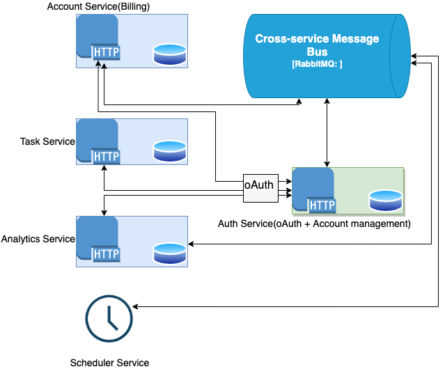

# uber-papug-ates
Repo for event-driven architecture course by https://education.borshev.com/architecture

All system requirements located in course materials page.


# Features

- Task Management

    - Create task and assign random worker - system charges task creation commission from the worker's account.

    - Complete task - system sends task completion revenue to the worker's account.

    - Shuffle tasks - All open(not completed) tasks will be reshuffled on randobly chosen workers. For each worker + task pair system behavious in the same way as item1 above.


- Account Management(Billing)

    - Register user's account in billing service once user created by Auth Service.

    - Billing Dashboard depends on worker/admin role(current account state with recent log description).

    - Manages user's account.

- Analytics

     - Register user's account in analytics service once user created by Auth Service.

     - Analytics Dashboard for admin role(top task price, time based stats, how much workers have negative score).


# System Architecture

We've taken event driven architecture for the designing based on course objectives.




## Architecture highlights
- Each service has two interfaces: synchronous(HTTP) and asynchronous(RabbitMQ connection).

- Each service has it's own database to reduce service coupling, increase reliability.

- Events in message bus are typed using common schema registry library([see](https://github.com/nickmetal/uber-papug-ates/tree/main/common_lib/schema)). That means that events are being validated during publish and consumption stages using common validator using that tool.

- Events definitions have version number for backward and forward compatibility

- Event processor has dead letter queue. In current implementation I chose MongoDB error collection as error storage. Once each service gets started it checks related errors there and tries to reprocess them.

- TODO

    - Add simple WebUI

    - Check [RabbitMQ stream](https://www.rabbitmq.com/streams.html) queue type for having distributed log capability instead of using classic rabbit queues(will allow offset reading/old messages read)

    - Check Kafka instead of RabbitMQ

    - Implement my own oAuth server

    - fix error "Channel is close" reestablish mq connection if it happens

    - Add postgresql db

    - Add tracing

    - Add tests

    - nginx/tls

    - fix bugs


# Event storming

A bit outdated, but shows the way of thinking during initial design stage.

> https://miro.com/app/board/uXjVO6P_vIE=/?share_link_id=474448053047


## How to run

1. setup service dependency - https://github.com/nickmetal/uber-papug-ates/tree/main/auth_service_external

2.  for each service set env variables and run `docker-compose up --build` inside the service folder

```sh
# 1. fill env vars
# NOTE: for docker and local env hosts might be different
export OAUTH_CLIENT_ID=
export OAUTH_CLIENT_SECRET=
export OAUTH_URL=http://localhost:3000/oauth/authorize
export OAUTH_TOKEN_URL=http://localhost:3000/oauth/token
export OAUTH_REDIRECT_URL=http://localhost:7777/auth_callback
export OAUTH_ACCONT_INFO_URL=http://localhost:3000/accounts/current
export OAUTHLIB_INSECURE_TRANSPORT=1  # for local dev only, needs to have tls
export RABBITMQ_DSN=localhost

export MONGO_DSN=
export MONGO_DB_NAME=papug_jira
export MONGO_ERROR_COLLECTION=errors

# 2. start auth service + message broken
# 3. start task service
# 4. start account service
# 5. start analytics service
# 6. start scheduler service
```


### Bugs

- fix mongo error: record id 62c05c040be92be5fb1e5d89
- keep rabbit stream pointer per each stream, not globally
